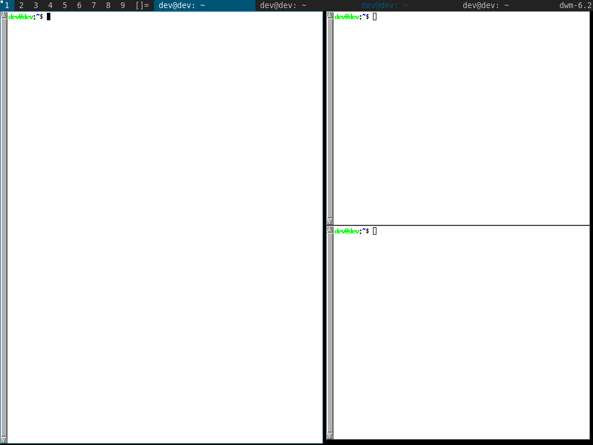

awesomebar
=====================

Description
-----------
This patch changes the taskbar to be more like awesome. To be specific, it:
* shows all tasks in the current tag in the taskbar at all times
* clicking on an unfocused window's title in the taskbar focuses that window
* clicking on a focused window's title in the taskbar hides that window
* clicking on a hidden window's title in the taskbar unhides and focuses that window

You can also hide and unhide windows from the keyboard. The default bindings are:
* M-j/M-k to cycle through the visible windows in the current workspace
* M-J/M-K to cycle through all windows in the current workspace - hidden windows shown this way are re-hidden once focus is lost
* M-h to hide the current active window
* M-s to unhide a window made visible by M-J/M-K
  
Since this patch relies on knowing how big everything is in the taskbar, make sure to adjust the buttonpress()/drawbar() functions to account for any space in the taskbar used by other patches (such as systray).

Changelog
---------
2020-09-07:
* add: manage hidden windows via keyboard

2020-08-29:
* fix: crash on empty bar click
* fix: hidden clients remain hidden after dwm restart
* add: awesomebar-statuscmd and awesomebar-statuscmd-signal combined patches as separate files

2019-03-10:
* fix: uneven tabs count produce visual glitches

Download
--------
2020-09-07 version:
* [dwm-awesomebar-20200907-6.2.diff](dwm-awesomebar-20200907-6.2.diff) (2020-09-07)

Updated version from Yegor Bayev:
* [dwm-awesomebar-20200829-6.2.diff](dwm-awesomebar-20200829-6.2.diff) (2020-08-29)
* [dwm-awesomebar-statuscmd-6.2.diff](dwm-awesomebar-statuscmd-6.2.diff) (2020-08-29)
* [dwm-awesomebar-statuscmd-signal-6.2.diff](dwm-awesomebar-statuscmd-signal-6.2.diff) (2020-08-29)

Original ornx patch:
* [dwm-awesomebar-6.2.diff](dwm-awesomebar-6.2.diff) (2019-06-27)

Authors
-------
* ornx <ornx[at]protonmail.com>
* Yegor Bayev <kodxpub@gmail.com>
