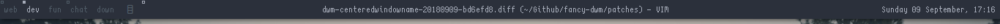

centeredwindowname
==================

Description
-----------
A little patch to center the WM\_NAME of the currently selected window on the
status bar.

Download
--------
* [dwm-centeredwindowname-20180909-6.2.diff](dwm-centeredwindowname-20180909-6.2.diff)
* [dwm-centeredwindowname-20190907-cb3f58a.diff](dwm-centeredwindowname-20190907-cb3f58a.diff)
* [dwm-centeredwindowname-20200723-f035e1e.diff](dwm-centeredwindowname-20200723-f035e1e.diff)

Authors
-------
* Sacules - <leociancalucas@gmail.com>
* [bastila](https://github.com/silentfault): Fix window name overflow
