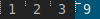

# clientindicators

This patch draws a dot indicator overlayed on each tag icon for each
client. The selected client is drawn as a larger horizontal line. This
may help the user get a quick overview of how many open clients they have
on which tags.

The clientindicatorshidevacant version of this patch combines
the functionality of the clientindicators patch with the
[hide vacant tags](/patches/hide_vacant_tags) patch.

## Download
* [dwm-clientindicators-6.2.diff](dwm-clientindicators-6.2.diff) (2020-08-17)
* [dwm-clientindicatorshidevacant-6.2.diff](dwm-clientindicatorshidevacant-6.2.diff) (2020-08-17)

## Author
- Miles Alan (m@milesalan.com)
