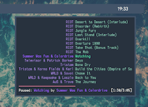

floatrules
==========

Description
-----------
Inspired by [smartborders](../smartborders/).

This patch adds 5 extra variables to the 'rules' array in `config.def.h`. These are:
* `floatx`, `floaty`, `floatw`, `floath` (if the window has the rule `isfloating`, the window will spawn with the geometry specified by these vairables)
* `floatborderpx` (border width when window is floating)

Setting `floatborderpx` to `-1` (or any value less than zero) will mean that the regular border width is used.

Please note that this patch needs `rm config.h` to be added to the `Makefile`.

\[since dwm-floatrules-20210801-138b405.diff\]:  
Setting any of `floatx`, `floaty`, `floatw`, `floath`  to `-1` (or any value less than zero) will mean that the geometry parameter should not be overwritten.

Screenshots:

Bugfixing
---------
From the original author: because I'm bad at programming and a bit lazy, the original patch had a few bugs in it.

Each bugfix has its own diff file. This way, if you have installed an earlier version, you can run `diff` on your old patch and the new one.
This provides an easy way for someone to see the changes and apply the updates themselves.

If you have not installed an old patch, using the latest version is obviously recommended.

Updates
-------
* 2020-11-19: Fixed a bug that caused rule-less windows to have no border (Alex Cole)
* 2020-11-14: Fixed a bug that added borders to fullscreen windows (Alex Cole)
* 2020-11-07: Added support for multiple monitors (Alex Cole)
* 2020-03-22: Typo fix (Jakub Profota)

Download
--------
* [dwm-floatrules-20210801-138b405.diff](dwm-floatrules-20210801-138b405.diff)
* [dwm-floatrules-20201119-d08dd9c.diff](dwm-floatrules-20201119-d08dd9c.diff)
* [dwm-floatrules-20201114-d08dd9c.diff](dwm-floatrules-20201114-d08dd9c.diff)
* [dwm-floatrules-20201107-61bb8b2.diff](dwm-floatrules-20201107-61bb8b2.diff)
* [dwm-floatrules-6.2.diff](dwm-floatrules-6.2.diff) (2020-03-01)

Author
------
* Alex Cole (original) <ajzcole at airmail.cc>
* Jakub Profota
* Natanael J Rabello

The original author would like to apologise for the several bugs that originally plagued even this relatively simple patch.
