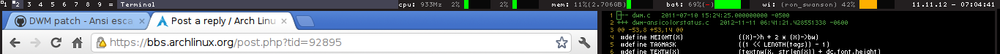

AnsiStatusColors
================
Colorize your status bar using ansi escape sequences.

Description
-----------
Lets you put colored text in your status bar, but you don't have define them in
your config.h. Instead, just put the ansi escape sequence in the output of your
status bar script to print in color, as you would in a terminal.

Usage
-----
Just like you'd use them for colorizing a shell script.

More info is here:
[http://www.frexx.de/xterm-256-notes/](http://www.frexx.de/xterm-256-notes/)

An ansi escape sequence is in the form:

	\e[<code>m

where:

	\e - escape - ascii 27 / hex 1b / octal 033
	[ - literal bracket
	m - literal 'm'

The code is one of the following:

	0 
	    - reset colors to default

	n;m

	    n -
	        o - normal color
	        1 - 'bright' color

	    m -
	        30-37 - foreground
	        40-47 - background

	n;5;m
	    
	    n - 
	        38 - foreground
	        48 - background
	    5 - 
	        literal '5'
	    m - 
	        0-15 - classic ansi color
	        16-231 - xterm 256-color rgb color
	        232-255 - grayscale

In vim, to create a literal 'escape' character, type ctrl-v, esc.
in perl/python/c, within a string literal, it's "\x1b".

Example
-------
	#!/usr/bin/env python
	##testcoloredstatus.py

	from subprocess import call,check_output

	redfg = '\x1b[38;5;196m' #hex
	redbg = '\033[48;5;196m'  #octal
	blackbg = '\x1b[48;5;16m'
	reset = '\x1b[0m'

	call(['xsetroot','-name',''.join(
	    [
	        redfg,
	        'hello ',
	        reset,
	        redbg,
	        'world',
	        reset,
	        '! bar graph: 50% ',
	        redbg,
	        ' '*5,
	        blackbg,
	        ' '*5,
	        reset,
	        '  ',
	        check_output("date").strip()
	    ]
	)], shell=False)

Screenshot
----------
My battery is discharging and my wifi signal is iffy...

Download
--------
* [dwm-ansistatuscolors-5.9.diff][dwm-ansistatuscolors-5.9.diff]
* [dwm-ansistatuscolors-6.0.diff][dwm-ansistatuscolors-6.0.diff]

Author
------
* Brandon Dowell <brandon DOT dowell AT gmail>
