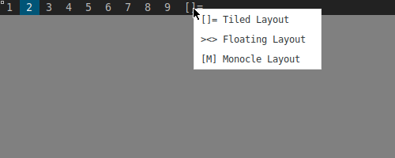
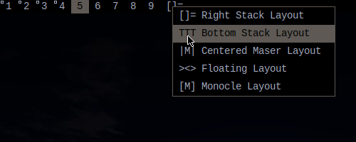

# layoutmenu

This patch adds a context menu for layout switching.

Right clicking on the layout icon brings an [xmenu](https://github.com/phillbush/xmenu) prompt for to pick a new layout, and switches to the selected one.

## Screenshots

Vanilla layouts

Extra layouts

## Usage

* [Xmenu](https://github.com/phillbush/xmenu) need to be installed.
* Edit `layoutmenu.sh` with the installed layouts and with correct indexes.
* Place `layoutmenu.sh` in PATH.
* The text of the menu items is for display only. Name them however you want.

## Download
* [dwm-layoutmenu-6.2.diff](dwm-layoutmenu-6.2.diff)

## Author
* [tdu](https://github.com/tdukv) - < tdukv at protonmail com>
