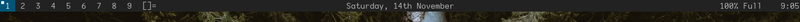

splitstatus
===========

Description
-----------
Inspired by a reddit post I saw, from someone who had already implemented this behaviour.
Code for this patch is based on their git repo.
Unfortunately, I cannot find the reddit post I saw in the first place (it was from quite a while ago).

This patch replaces the standard statusbar items (window name to the right of the tags, and status on the right) with two status items: one in the centre, and one on the right.

The status is still set in the same way with `xsetroot`. However, for the splitstatus behaviour, a delimeter character is added (semicolon by default) to separate the centre status text from the right status text.

Usage
-----
Status should be set in the form `<middle>;<right>` if semicolon is the delimeter character (set using the `splitdelim` variable in `config.def.h`).

If the status text does not contain the delimeter character, the text will appear only in the centre of the bar.
This can be changed by setting the option `splitstatus` to 0, which will put the status text on the right.

Please note that this patch needs `rm config.h` to be added to the `Makefile`.

Screenshots:

Download
--------
* [dwm-splitstatus-20201114-61bb8b2.diff](dwm-splitstatus-20201114-61bb8b2.diff)

Author
------
* Alex Cole <ajzcole at airmail.cc>
