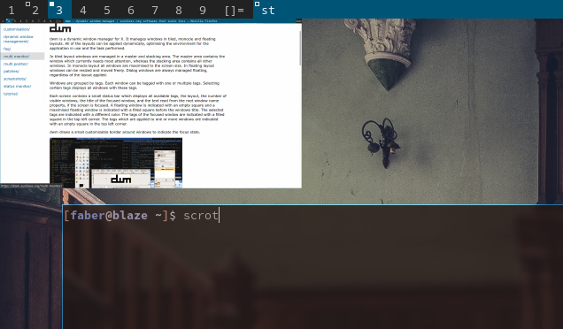

tag previews
================

Description
-----------
Allows you to see the contents of an already viewed tag. So a more accurate
description would be to re-view a tag.

This is done with Imlib2. This patch is extracted from
https://github.com/siduck76/chadwm. Keep in mind this moves `monitor` struct
below `#include config.h` so it can read the 'LENGTH' of your tags, since it's
defined in config.h. A workaround if you get into compatibility issues is to
just put 9 (or the number of tags you have) and remove the macro, the below
a patch that does that.

	@@ -271,6 +254,31 @@ static Window root, wmcheckwin;
	 /* configuration, allows nested code to access above variables */
	 #include "config.h"

	struct Monitor {
		char ltsymbol[16];
		float mfact;
		int nmaster;
		int num;
		int by;               /* bar geometry */
		int mx, my, mw, mh;   /* screen size */
		int wx, wy, ww, wh;   /* window area  */
		unsigned int seltags;
		unsigned int sellt;
		unsigned int tagset[2];
		int showbar;
		int topbar;
		Client *clients;
		Client *sel;
		Client *stack;
		Monitor *next;
		Window barwin;
		Window tagwin;
		int previewshow;
	-	Pixmap tagmap[LENGTH(tags)];
	+	Pixmap tagmap[9];
		const Layout *lt[2];
	};

Download
--------
* [dwm-tag-preview-6.2.diff](dwm-tag-preview-6.2.diff)
* [github mirror](https://github.com/explosion-mental/Dwm/blob/main/Patches/dwm-tag-preview-6.2.diff) (issues and contribs)

Authors
-------
* explosion-mental - <explosion0mental@gmail.com>
