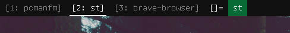

underlinetags
=============

Description
-----------
Underlines selected tags. This looks good for certain color schemes.

This screenshot also uses my [taglabels](../taglabels) patch, as well as [hide\_vacant\_tags](../hide_vacant_tags).

Config variables are avaliable to edit the size and position of the underline, as well as an option to underline all tags instead of just the active ones.

Download
--------
* [dwm-underlinetags-6.2.diff](dwm-underlinetags-6.2.diff)

Author
------
* Timmy Keller <applesrcol8796@gmail.com>
