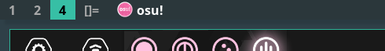

winicon
========

Description
-----------
**dwm-winicon** is a patch that enables dwm to show window icons.

It is recommended to enable the compiler optimization flags: **-O3** and **-march=native** to enable auto loop vectorize, which leads to better performance.

The patch is being managed and developed on this GitHub [repo](https://github.com/AdamYuan/dwm-winicon). If you discover any bugs or have any idea to optimize it, feel free to create an issue there.

Dependency
----------
The patch depends on Imlib2 for icon scaling, which can be easily installed in most distros.

Arch Linux:
	sudo pacman -S imlib2
Debian:
	sudo apt install libimlib2-dev

Configuration
-------------
	#define ICONSIZE 20   /* icon size in pixels */
	#define ICONSPACING 5 /* space (pixels) between icon and title */

There are also some practical macro hacks:
	#define ICONSIZE bh       /* make icon size equals to bar height */
	#define ICONSIZE (bh - 4) /* or adaptively preserve 2 pixels each side */

Download
--------
* [dwm-winicon-6.2-v2.0.diff](dwm-winicon-6.2-v2.0.diff) (2021-08-17)

Alpha Patch
-----------
If you also use [alpha patch](https://dwm.suckless.org/patches/alpha/), some modifications are needed to make dwm work correctly.
* Replace (in drw.c, drw_create function)
	drw->picture = XRenderCreatePicture(dpy, drw->drawable, XRenderFindVisualFormat(dpy, DefaultVisual(dpy, screen)), 0, NULL);
with 
	drw->picture = XRenderCreatePicture(dpy, drw->drawable, XRenderFindVisualFormat(dpy, visual), 0, NULL);
* Replace (in drw.c, drw_resize function)
	drw->picture = XRenderCreatePicture(drw->dpy, drw->drawable, XRenderFindVisualFormat(drw->dpy, DefaultVisual(drw->dpy, drw->screen)), 0, NULL);
with 
	drw->picture = XRenderCreatePicture(drw->dpy, drw->drawable, XRenderFindVisualFormat(drw->dpy, drw->visual), 0, NULL);

Author
------
* Adam Yuan - `<y13916619121@126.com>`
