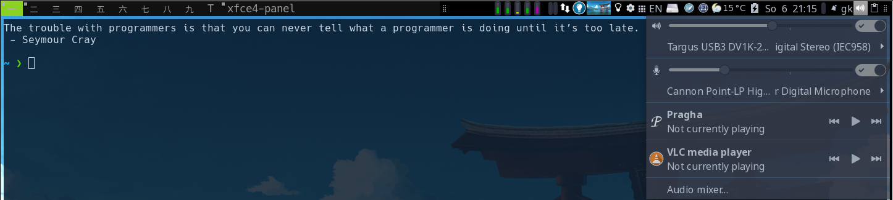
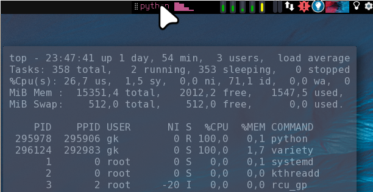

xfce4-panel
===========

Description
-----------

When xfce4 tools are on the system anyway, it might make sense to use the xfce4-panel in dwm.
This patch modifies dwm, so that it treats any window with name `xfce4-panel` (default)
as a status bar, i.e.:

- it never has borders
- it never has focus
- always has y=0
- it is never shown as active window in the tag indicators
- it is shown on all tags (via a tag rule in the config)
- it is ignored on `focusstack` (MOD+j / MOD+k)

- The panel does act as systray for third party tools, i.e. the systray patch is no more required
- Looks best when background is set to same color as the dwm statusline (black in the example)
- Using a compositor you can dimm or completely hide it, when not hovered

The patch has been created against dwm6.2.  

Download
--------

* [dwm-xfce4-panel-20210701-67d76bd.diff](dwm-xfce4-panel-20210701-67d76bd.diff) (2021-07-01)

Notes
-----

- The workspace switcher won't work interactively, but dwm's interactive tag indicators remain on the left anyway.
- Some actions in the "session menu" applet (the one with your name as title) won't work out of the box. You might supply your own sub menu or modify the actions of the existing one.
- The rest of xfce4's 40 or so panel apps _should_ work (if installed) and also custom "applets" (see below) are working 
- Startup: A start via xinitrc should be fine. I use the [autostart](https://dwm.suckless.org/patches/autostart/) patch to start
  in background:

        sleep 0.3
        xfce4-panel --disable-wm-check

Panel Config
------------

**dwm**  
In dwm's rules, the panel should be configured to be shown on all tags - see the patch.

**xrandr**:  
Since the panel will reside always at `y=0`, a matching xrandr screenlayout must contain `--pos 0x0` for the monitor where the panel should be shown. That monitor must be connected, otherwise the panel won't be visible or pop up in the middle of another monitor. When you unplug that monitor, you need to have a valid new screen layout loaded. I use the monitor marked `--primary`. The [`arandr`](https://christian.amsuess.com/tools/arandr/) tool will create valid configs. I always have a fallback layout, with the laptop display configured primary, at `0x0`.

    # Example:
    xrandr --output eDP-1 --primary --mode 1920x1080 --pos 0x0 --rotate normal

You can verify your screen layout using e.g. the `xev` tool, which reports the mouse coordinates relative to root.

**xfce4-panel config**:  
The rest of the config is done via XFCE4's internal tools, available e.g. via `xfce4-settings-manager` -> panel:

- Configure exactly one Panel, e.g. via `xfce4-settings-manager` -> `panel`
- At Tab Display:

    - Mode Horizontal   
    - Output: Your primary monitor (with y=0). Panel will stay there(!)  
    - Lock Panel: false  
    - Row size: Should probably match height of dwm statusbar, which depends on your dwm font size.
    - Autom. increase the length: true  
    - Length: 1% (will auto adapt)  

- At Tab Appearance:

    - Adjust icon size automatically  
    - Autohide when not hovered: Run a compositor e.g. `picom` and set panel's "leave opacity" to 0. That way you could have a minimalistic dwm statusbar normally and the full interactive status bar only on mouse over. I prefer to rather dimm it down to an unobtrusive 30%.

Also the _content_ of the panel you configure "normally", i.e. by adding items in the panel's items tab or via [CLI tools](https://docs.xfce.org/xfce/xfconf/xfconf-query).

Tips:

- The warning `Failed to connect to session manager` at panel startup is normal. I do not advise to start `xfce4-session` from within dwm to fix it. This will try auto explore your available workspaces - and possibly conclude you have `2**9 * monitor count`, writing that back into the xfce4 config. I had to manually clean up the config via [xfconf](https://docs.xfce.org/xfce/xfconf/xfconf-query).
- Using xfconf and the panel config backup/restore tool might be the best way to have *different* panel setups in xfce4 and dwm, should you want to use xfce4 as well, where people often run more than one panel.

Below is a usage example for adding your own information into the panel.

Optional: Using the `genmon` Applet
-----------------------------------

Most panels offer the possibility to include generic scripts output.  
In `xfce4-panel` this is done by the panel item: "Generic Monitor" (genmon). It features output styled with pango markup and mouseover/onclick hooks.

Here are some `genmon` script collections:
- [xfce4-genmon-scripts](https://awesomeopensource.com/project/xtonousou/xfce4-genmon-scripts)
- [xfce4-genmon-scripts-2](https://github.com/almaceleste/xfce4-genmon-scripts)
- [xfce4-genmon-scripts-3](https://github.com/levimake/xfce4-genmon-panel-scripts)

Manual is [here](https://docs.xfce.org/panel-plugins/xfce4-genmon-plugin/start#usage).

Personally I wanted to have CPU monitor, which shows the name of current high cpu eater(s) if present (next to current load by core) and on mouseover remembers the top output from the most recent high load situation in the past:

To get that, I cat the content of a file generated by this script, started in `autostart.sh` in the background:
[cpu_mon.py](cpu_mon.py).

Author
-------
* Gunther Klessinger <gklessinger[at]gmx.de>

