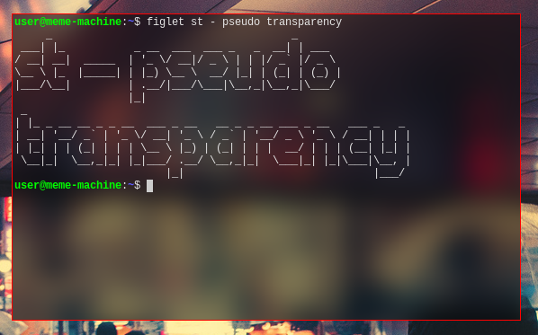

background image
================

Description
-----------

Draws a background image in place of the defaultbg color.

Notes
-----

The path to the image file has to be configured in `config.h` using the variable
`bgimg` (patch modifies `config.def.h`). The image format is expected to be 
[farbfeld](//tools.suckless.org/farbfeld). In case the background image 
is smaller than the window size the background will be tiled.

Pseudo Transparency
-------------------

The variable `pseudotransparency` enables functionality which fixes the 
coordinates of the background image to the screen origin. This emulates the 
effect of transparency without the need for an *X composite manager*.

*Hint*: With the use of [farbfeld utilities](http://zzo38computer.org/fossil/farbfeld.ui/) 
effects can be applied to the desktop background in an automated fashion. 
Pictured below is an example of the result of a darken and blur operation 
invoked with the following command:

	jpg2ff < wallpaper.jpg | ff-border e 50 | ff-bright rgba 0 0.5 1 | ff-blur 50 15 > st_wallpaper.ff

Download
--------
* [st-background-image-0.8.4.diff](st-background-image-0.8.4.diff)

Authors
-------
* Matthias Schoth - <mschoth@gmail.com>

