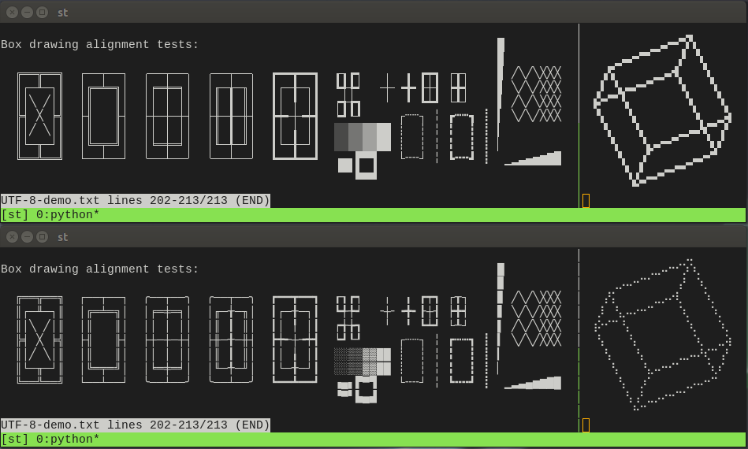

boxdraw
=======

Summary
-------
Custom rendering of lines/blocks/braille characters for gapless alignment.

Example
-------
Lines/blocks, tmux splitter, braille "graphics". The top one is with boxdraw:

Description
-----------
Graphic lines and blocks characters such as those used by `dialog`, `tree`,
`tmux` etc sometimes align with gaps - which doesn't look very nice. This can
depend on font, size, scaling, and other factors.

Braille is also increasingly used for graphics (`mapscii`, `vtop`, `gnuplot`,
etc), and may look or align nicer when rendered as "pixels" instead of dots.

This patch adds options to render most of the lines/blocks characters and/or the
the braille ones without using the font so that they align perfectly regardless
of font, size or other configuration values.

Supported codepoints are U2500 - U259F except dashes and diagonals, and U28XX.

See also: unicode references
[U2500.pdf](http://www.unicode.org/charts/PDF/U2500.pdf),
[U2580.pdf](http://www.unicode.org/charts/PDF/U2580.pdf),
[U2800.pdf](http://www.unicode.org/charts/PDF/U2800.pdf),
and example pages
[UTF-8-demo.txt](https://www.cl.cam.ac.uk/~mgk25/ucs/examples/UTF-8-demo.txt)
and
[libvte test page](https://github.com/GNOME/vte/blob/master/doc/boxes.txt).

Notes:
------
* The download is a `git --format-patch` file. It can be applied either with
  `git am ...`, or with `patch -p1 < ...`.
* boxdraw/braille are disabled by default and configured via `config.h`.
  You may need to copy the boxdraw lines from `config.def.h` to `config.h`.

Download
--------
[st-boxdraw_v2-0.8.3.diff](st-boxdraw_v2-0.8.3.diff)

History
-------
* boxdraw v2-0.8.3: no code changed. Only rebased and adds patch meta-info for
improved conflict resolution when `git am -3` is used.
* boxdraw v2-0.8.2: adds shades, braille (U28XX), configurable bold.
  * [st-boxdraw_v2-0.8.2.diff](st-boxdraw_v2-0.8.2.diff)
* boxdraw (v1): U2500-U259F except dashes/diagonals/shades. Bold is thicker.
  * [st-boxdraw-20181101-30ec9a3.diff](st-boxdraw-20181101-30ec9a3.diff)

Author
------
* Avi Halachmi (:avih) - [https://github.com/avih](https://github.com/avih)
