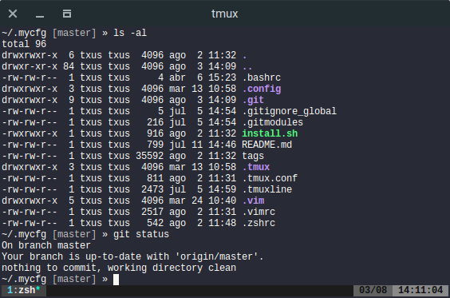

dracula
=========

Description
-----------
[Dracula](https://draculatheme.com/) is a color scheme made by Zeno Rocha based
on Solarized. This patch make the Dracula color scheme available for st.

Notes
-----
Once applied, only the terminal colors are changed. You can find a
[vim colorscheme](https://draculatheme.com/vim/) and much more at
[https://draculatheme.com/](https://draculatheme.com/).

Example
-------

Running zsh and tmux.

Download
--------
* [st-dracula-0.8.2.diff](st-dracula-0.8.2.diff)

Authors
-------
* Jesús López - <jsus90@gmail.com>
