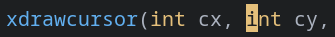

dynamic-cursor-color
====================

Description
-----------
Swaps the colors of your cursor and the character you're currently on (much like alacritty). Some say the effect is very appealing:)

Notes
-----

Might be incomplete - I'm new and improvements are very welcome!

- Might have some edge cases where it doesn't work properly
- Performance degradation considerations? More testing & feedback needed

Download
--------
* [st-dynamic-cursor-color-0.8.4.diff](st-dynamic-cursor-color-0.8.4.diff)

Authors
-------
* Kipras Melnikovas ([kipras.org](http://kipras.org)) <kipras@kipras.org>
* Stein Gunnar Bakkeby ([github.com/bakkeby](http://github.com/bakkeby))

See also: [github.com/bakkeby/st-flexipatch/issues/10](https://github.com/bakkeby/st-flexipatch/issues/10)
