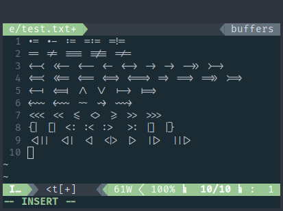

Ligature support
================

Description
-----------
This patch adds proper drawing of ligatures.

The code uses Harfbuzz library to transform original text of a single line to a list of glyphs with ligatures included.

Example
-------
Taken with Fira Code Regular 14pt:

Notes
-----
* The patch adds additional dependency on Harfbuzz library and headers.
* Original patch was made for vanilla version of ST from latest master commit. It is not 100% compatible with Scrollback and Alpha patches, so I made modified versions that you can apply on top of a Scrollback and/or Alpha patch.
* Due to some limitations in drawing engine, ligatures will break when crossing colors, font styles or selection. They will still render properly as separate symbols, just not as ligatures.
* Since 0.8.4 patch, there's now a way to enable additional font rendering features. Look into `features` array in `hb.c` for details.

Boxdraw
-------
* The original patch does not work very well with the boxdraw patch. Since it requires some additional changes in the code to make ligatures compatible with boxdraw, a special version of the patch was added, that you can apply on top of the boxdraw patch.
* It does not include Alpha or Scrollback patches.

Download
--------
**0.8.4**:
* [st-ligatures-0.8.4](0.8.4/st-ligatures-20210824-0.8.4.diff)
* [st-ligatures-scrollback-0.8.4](0.8.4/st-ligatures-scrollback-20210824-0.8.4.diff)
* [st-ligatures-alpha-0.8.4](0.8.4/st-ligatures-alpha-20210824-0.8.4.diff)
* [st-ligatures-alpha-scrollback-0.8.4](0.8.4/st-ligatures-alpha-scrollback-20210824-0.8.4.diff)
* [st-ligatures-boxdraw-0.8.4](0.8.4/st-ligatures-boxdraw-20210824-0.8.4.diff)

**0.8.3**:
* [st-ligatures-0.8.3](0.8.3/st-ligatures-20200430-0.8.3.diff)
* [st-ligatures-scrollback-0.8.3](0.8.3/st-ligatures-scrollback-20200430-0.8.3.diff)
* [st-ligatures-alpha-0.8.3](0.8.3/st-ligatures-alpha-20200430-0.8.3.diff)
* [st-ligatures-alpha-scrollback-0.8.3](0.8.3/st-ligatures-alpha-scrollback-20200430-0.8.3.diff)
* [st-ligatures-boxdraw-0.8.3](0.8.3/st-ligatures-boxdraw-20200430-0.8.3.diff)

**0.8.2-28ad288**:
* [st-ligatures](28ad288/st-ligatures-20200428-28ad288.diff)
* [st-ligatures-scrollback](28ad288/st-ligatures-scrollback-20200428-28ad288.diff)
* [st-ligatures-alpha](28ad288/st-ligatures-alpha-20200428-28ad288.diff)
* [st-ligatures-alpha-scrollback](28ad288/st-ligatures-alpha-scrollback-20200428-28ad288.diff)
* [st-ligatures-boxdraw](28ad288/st-ligatures-boxdraw-20200428-28ad288.diff)

Authors
-------
* Alexander Rogachev - [https://github.com/cog1to](https://github.com/cog1to)
