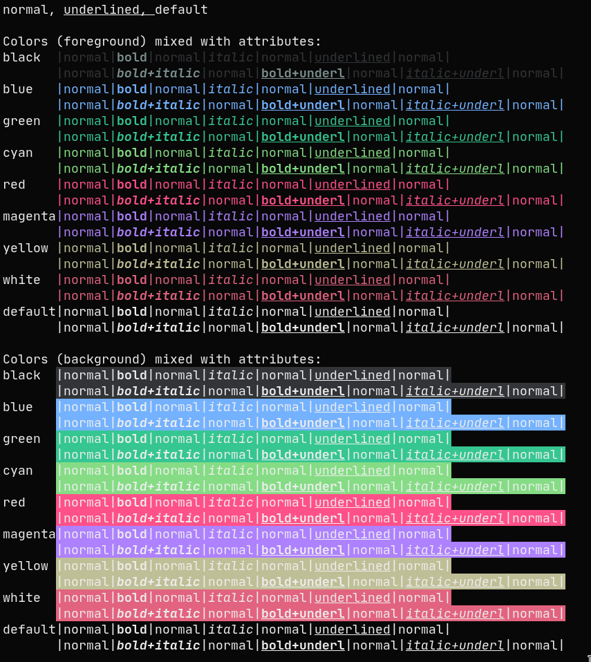

Moonfly
=========

Description
-----------
[Moonfly](https://github.com/bluz71/vim-moonfly-colors) is a dark color scheme for Vim and Neovim made by [bluz71](https://github.com/bluz71)

Notes
-----
Once applied, only the terminal colors are changed. You can find a
[vim colorscheme](https://github.com/bluz71/vim-moonfly-colors) and much more at
[the git repo](https://github.com/bluz71/vim-moonfly-colors).

Example
-------

Running zsh.

Download
--------
* [st-moonfly-0.8.2.diff](st-moonfly-0.8.2.diff)

Authors
-------
* Hitarth Thummar - <https://github.com/gtlsgamr>
