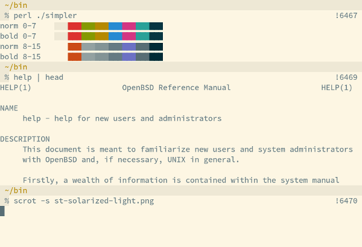
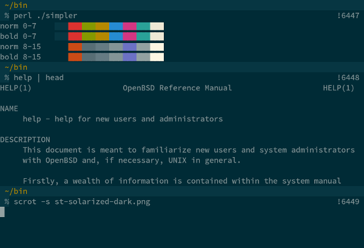

solarized
=========

Description
-----------
[Solarized](http://ethanschoonover.com/solarized) is a color scheme by Ethan
Schoonover which exists in a dark and a light variant. These patches make the
Solarized color scheme available for st.

Notes
-----
Once applied, only the terminal colors are changed.  For applications
such as tmux or vim, you may need to
[adjust the colors there as well](https://bbs.archlinux.org/viewtopic.php?id=164108).

Example
-------

The font used is Source Code Pro.

Download
--------
To get correct colors, you first need to apply the following patch
to disable lighting up bold colors.

* [st-no\_bold\_colors-0.5.diff](st-no_bold_colors-0.5.diff)
* [st-no\_bold\_colors-0.6.diff](st-no_bold_colors-0.6.diff)
* [st-no\_bold\_colors-0.7.diff](st-no_bold_colors-0.7.diff)
* [st-no\_bold\_colors-0.8.1.diff](st-no_bold_colors-0.8.1.diff)
* [st-no\_bold\_colors-20170623-b331da5.diff](st-no_bold_colors-20170623-b331da5.diff)

Choose one of the following patches to get either the light
or the dark color scheme:

*Light*:

* [st-solarized-light-0.5.diff](st-solarized-light-0.5.diff)
* [st-solarized-light-0.6.diff](st-solarized-light-0.6.diff)
* [st-solarized-light-0.7.diff](st-solarized-light-0.7.diff)
* [st-solarized-light-20170623-b331da5.diff](st-solarized-light-20170623-b331da5.diff)
* [st-solarized-light-20190306-ed68fe7.diff](st-solarized-light-20190306-ed68fe7.diff)

*Dark*:

* [st-solarized-dark-0.5.diff](st-solarized-dark-0.5.diff)
* [st-solarized-dark-0.6.diff](st-solarized-dark-0.6.diff)
* [st-solarized-dark-0.7.diff](st-solarized-dark-0.7.diff)
* [st-solarized-dark-20170623-b331da5.diff](st-solarized-dark-20170623-b331da5.diff)
* [st-solarized-dark-20180411-041912a.diff](st-solarized-dark-20180411-041912a.diff)

*Both (swap between light/dark with F6)*:

* [st-solarized-both-0.8.1.diff](st-solarized-both-0.8.1.diff)
* [st-solarized-both-20170626-b331da5.diff](st-solarized-both-20170626-b331da5.diff)
* [st-solarized-both-20190128-3be4cf1.diff](st-solarized-both-20190128-3be4cf1.diff)
* [st-solarized-both-0.8.3.diff](st-solarized-both-0.8.3.diff)
* [st-solarized-both-0.8.4.diff](st-solarized-both-0.8.4.diff)

Authors
-------
* Nils Reuße - <nilsreusse@gmail.com>
* Laslo Hunhold - <dev@frign.de> (0.5, 0.6, git ports)
* Ryan Roden-Corrent - <ryan@rcorre.net> (both)
* Marcel Krüger - <zauguin@gmail.com> (older git ports)
* Harry Gindi - <harry.gindi@live.com> (git ports for light, dark, and swap versions)
* Matthew Parnell - <matt@parnmatt.co.uk> (0.7 port)
* Linh Nguyen - <linhvng.2212@gmail.com> (0.8.1 port for no\_bold\_colors and swap versions)
* Varun Iyer - <vi.mail@protonmail.ch> (20190129 port for swap version)
* Paschalis Bizopoulos (20190306 port for light version)
* Joachim Büchel - <jo@audijo.de> (0.8.3 port for swap version)
