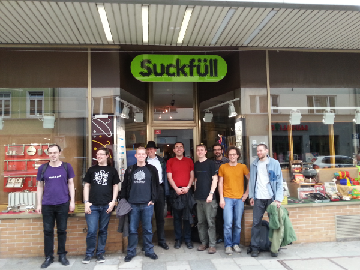

suckless conference 2013, Munich
================================

Saturday, 2013-06-22
====================

        LMU MÜNCHEN (Ludwig-Maximilians-Universität)
        Theresienstr 39
        80333 München

        Room A027 / Raum A027

Talks
-----
(10:00-10:40) *Welcome the future of dwm*, Anselm R Garbe ([slides](slcon13.pdf))

        Anselm presented his plan about the next steps of the dwm
        development.

Video:

(10:40-11:20) *st - the past and future*, Christoph Lohmann ([slides](20h_on_st.pdf))

        Christoph presented his plan about the next steps of st development.

Video:

(11:45-13:00) *Bugs found by musl*, Szabolcs Nagy ([slides](http://port70.net/~nsz/slcon/bugs_talk.html))

        Szabolcs picked a few issues found by musl and to show how a new libc can be
        (and is) beneficial.

Video:

(14:40-15:20) *runit and ignite*, Christian Neukirchen

        Christian presented runit and ignite and discussed if these systems
        are in line with the suckless philosophy.

Video:

(15:20-16:20) *The costs of abstraction*, Szabolcs Nagy ([slides](http://port70.net/~nsz/slcon/abstraction_talk.html))

        Szabolcs discussed why C is still the only serious programming language.

Video:

(16:20-16:50) *The suckless web ideas*, Christoph Lohmann ([slides](20h_on_surf.pdf))

        Christoph discussed suckless web ideas.

Video:

(16:50-17:15) *stali and other stuff*, Anselm R Garbe ([slides](slcon13.pdf))

Video:

