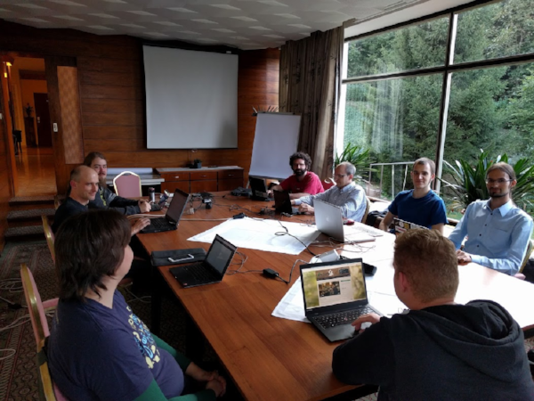

suckless conference 2016, Hofheim am Taunus, Germany
=========================================================

slcon 2016 was held in Hofheim am Taunus near Frankfurt am Main on
2016-09-(23-25).

Friday, 2016-09-23
==================
Arrival day.

(19:30) *Gathering in the "Waldgeist"*

> We gathered together in and checked out the
> [Waldgeist](http://www.derwaldgeist.de/) restaurant that was within
> walking distance of the hotel.

Saturday, 2016-09-24
====================
(10:00-10:05) *Welcome*, Anselm R Garbe

> Anselm opened the slcon 2016 talk session

Video:

(10:10-10:40) libzahl -- simple bignum arithmetic, Mattias Andrée

> The quality of algorithms usually increases with their complexity.
> Can we, despite that, compete with GNU MP and other libraries
> and still provide suckless solution? This talk discussed libzahl's
> design and future.

Video:

(10:50-11:15) XML damage control, Silvan Jegen ([slides](//dl.suckless.org/slcon/2016/slcon-2016-02-sjegen-xml_damage_control.pdf))

> XML is a horrendously abused file format that severely suffers from
> over-engineering. However, there is an arguably legitimate use case for
> a subset of it: Text markup. This talk gave reasons for that and showed
> how to deal with XML in these circumstances.
> The presenter, forced to work with XML every day, first gave an
> overview of different XML parsing strategies and presented a few decent
> libraries for this purpose. To allow comparison, he benchmarked the
> most sensible XML libraries and discussed alternative parsing approaches
> as well as their implementation.

Video:

(11:20-11:35) Stali Pi B+, Manu Raster ([slides](//dl.suckless.org/slcon/2016/slcon-2016-03-mraster-stali_pi_bplus.pdf))

> This talk gave a report on readying stali for the Raspberry Pi B+
> (32 bit) and is also a story about monsters and maiden, as it compared
> the stali approach to other codebases (kernels, distros, etc.) and their
> build systems, evaluating portability concerns encountered along the way
> on a scale from "depraved" over "naive" to "not too bad".

Video:

(11:40-12:05) farbfeld and color spaces, Laslo Hunhold

> This talk discussed the future role of color management in computing
> in light of recent developments and gave a future perspective on
> necessary changes to the handling of image formats like farbfeld.

> Are you already affected by the limitations of sRGB? You can find out
> by looking at the saturated RGB triplets below. The one on the right
> shows the saturated reds, greens and blues of sRGB, the one on the left
> shows the saturated reds, greens and blues of your monitor. If you only
> see continuous lines it means that you're not working within a color
> managed environment (e.g. using Firefox with colord and xiccd), or your
> screen is really old.

Video:

(12:05-13:25) Lunch break

(13:25-14:10) scc and qbe for practical compilation, Roberto E. Vargas Caballero

> For decades we have been witnessing a dramatic increase in compiler
> complexity. Popular compilers have become huge C++ programs trying
> to incorporate every aspect of state-of-the-art research.
> This talk proposed scc and qbe as a new approach to compilation, where
> simplicity and predictability are the primary objective over reckless
> efficiency and optimization.
> It presented the security benefits resulting from this alternative design
> approach, that is also advocated by the "boring crypto" movement, and
> demonstrated how it allows easier bootstrapping of new systems.

Video:

(14:10-15:15) The Myrddin Programming Language, Ori Bernstein ([slides](//dl.suckless.org/slcon/2016/slcon-2016-06-obernstein-the_myrddin_programming_language.pdf))

> This talk presented the Myrddin programming language that was written
> in the interest of a saner and easier to use programming environment
> the presenter, inventor of the language, deems more pleasant than C.
> The presenter elaborated on its position between C and the ML
> programming language by design using concepts like parametric
> polymorphism, type inference, closures and pattern matching, concluding
> that it can be thought of as a suckless Rust. In this context,
> examples were presented using a replacement for many standard libraries
> on a number of popular (and less popular) platforms.

Video:

(15:20-15:50) ii-like chatting improvements, Jan Klemkow

> Since the last conference, the presenter had made several improvements
> in his ii-like chat infrastructure and in this talk gave an overview of
> his various activities in this area, presenting new features of his
> [UCSPI tools](https://github.com/younix/ucspi), a new modular frontend
> [lchat](https://github.com/younix/lchat) and the idea of runit
> integration.

Video:

(15:50-16:25) text engine, Francesc Hervada-Sala

> The right approach to software systems was introduced by the Unix
> programming environment over forty years ago with a file system that
> opened access to data across all applications and with a universal
> interface model based on strings.
> This talk claimed that this approach should be deepened by defining
> "text" as the semantic data structure that results from parsing
> strings, theorizing a software system with a "text engine" at its
> kernel and discussing improvements it can bring to modern data
> processing and user experience.

Video:

(16:25-16:35) Coffee break

(16:35-17:15) Suckless Image Processing, EML ([slides](//dl.suckless.org/slcon/2016/slcon-2016-09-emeinhardtl-suckless_image_processing.pdf))

> This talk picked up the conception of an image being an array of numbers
> and deduced that C is well suited for image processing algorithms,
> given arrays of numbers are natively representable in it.
> It also elaborated on and exemplified how many complex image processing
> algorithms are pipelines of simple, independent steps, making the Unix
> programming environment an ideal platform for image processing with
> several simple programs written in C sharing information through
> pipes.
> In this context, the problem of selecting a proper file format for
> pipe interchange is discussed and claimed that the farbfeld image
> format is not suitable for this task and general image processing.

Video:

(17:20-17:45) shared farbfeld, Jan Klemkow

> This talk explored farbfeld as a basis for general purpose image
> processing based on the idea of cooperative image processing tools,
> presenting a shared memory interface that speeds up the usage of
> these tools. Based on this foundation, the architecture of a
> Photoshop-like image editor is presented with the proof of concept
> implementation [shmff](https://github.com/younix/shmff) and benchmarks
> supporting this idea.

Video:

(17:45-17:50) Display servers, Mattias Andrée

Video:

(17:50-18:30) stali learnings and beehive observation, Anselm R Garbe

> This talk presented the experience gained with stali since the last
> slcon, discussing new goals and why self-bootstrappability is a bad
> idea in particular. As a proof of concept, the presenter demonstrated
> stali as a platform for observing his beehives.

Video:

Official slcon 2016 talk session end.

(18:55-19:20) suckless.org e.V. Mitgliederversammlung (suckless.org e.V. general assembly)

> The yearly general assembly consisted of the report of the chairs,
> Anselm R Garbe and Laslo Hunhold, the report of the treasurer,
> Jan Klemkow, and the discussion of topics raised by members.

Video:

(19:30-) Social event in Frankfurt am Main City

Sunday, 2016-09-25
==================
No talk session plans, hack sessions and departure day.

Acknowledgment
==============
We kindly thank  for
lending us the equipment to record the slcon 2016 conference videos.

Previous conferences
====================
* [slcon 2015](../2015/)
* [slcon 2013](../2013/)
