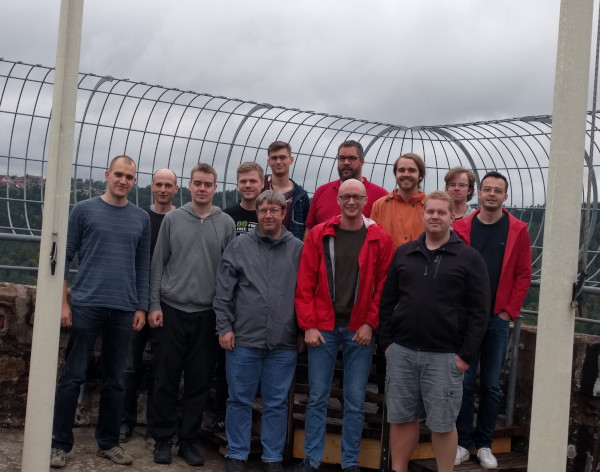
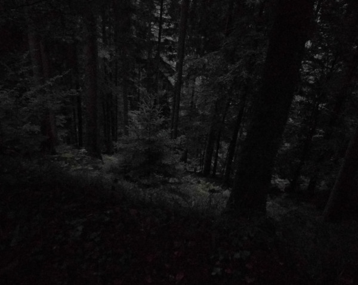

suckless conference 2019, Bad Liebenzell, Germany
=================================================

Friday, 2019-10-04
------------------

### (14:00-18:00) Arrival at the venue

### (18:00) Dinner

### (20:00) suckless.org e.V. general assembly meeting

Saturday, 2019-10-05
====================

### (08:00-09:00) Breakfast

### (11:00-12:00) Talk sessions

#### OpenBSD supremacy, Laslo Hunhold

> A look at recent developments in OpenBSD and a discussion about how
> to include these advances in suckless tools.
> 
> Video:
> 
> 

### (12:00-13:00) Lunch

### (13:00-18:00) Talk sessions

#### Machine Translation, Manu Raster

> The topic I would like to present is "Machine Translation" and it is in
> the spirit of Douglas Hofstadters destructive critique¹ and my own
> critique of Franz-Josef Ochs² concepts of translation from a history of
> science point of view. In comparison to the early beginnings (Bar-Hillel
> 1960 "The Present Status of Automatic Translation of Languages") little
> progress has been made. In particular I will explain
> 
> - why engineers use intermediate languages (IL) and why they suck
>  - analogies between code generation and literature translation
>  - keywords: philologists and barbarians, the babelfish-device, binary-size sanity
> - how translation fails on IL-level and surface level (destination language)
> - what a good computer assisted translation tool for advanced users can
>   achieve such as an Acme-based tool³
> 
> and present reproducable examples where Google Translate™ and its
> epigones fail systematically.
> 
> [1]: https://www.theatlantic.com/technology/archive/2018/01/the-shallowness-of-google-translate/551570/ https://www.youtube.com/watch?v=2xnr-ST6ITo&t=294s
> [2]: https://www.youtube.com/watch?v=rThQedY-H4Q http://sylvester.bth.rwth-aachen.de/dissertationen/2003/059/03_059.pdf
> [3]: Nichols, E., Matsumoto, Y. 2007. Acme as an Interactive Translation Environment. in: Proceedings of the Second International Workshop on Plan 9, pp. 35–45, Murray Hill, USA, December 3-4, 2007
> 
> Video:
> 
> 

#### The Static Web, Laslo Hunhold

> A presentation of the concept of the 'static web', an approach to web
> development using static websites and special approaches to data integration.
> 
> Video:
> 
> 

#### Acme changed my life, Marc Chantreux

> Acme is the editor of choice in plan9. I don't use it but when trying
> it, I realized that vim is much more than an editor: it's an open window
> to my whole digital world: A perfect multipurpose UI. Let me show you ...
> 
> [slides](https://github.com/eiro/talk-acme-changed-my-life)
> 
> Video:
> 
> 

### (18:00-19:00) Dinner

### (19:00-) Evening program

> 

Sunday, 2019-10-06
------------------

### (08:00-09:00) Breakfast

### (09:00-10:00) Hacking

### (10:00-12:00) Talk sessions

#### Blind demonstration, Mattias Andrée

> A demonstration of the blind video editor.
> 
> Video:
> 
> 

#### Reflections on Unicode, Laslo Hunhold

> Dealing with Unicode is a difficult balancing between correctness
> and complexity. This talk presents recent results of the author with
> regard to suckless Unicode handling in C at the level of grapheme
> clusters.
> 
> Video:
> 
> 

### (12:00-13:00) Lunch

### (13:00-16:00) Hacking and departure
