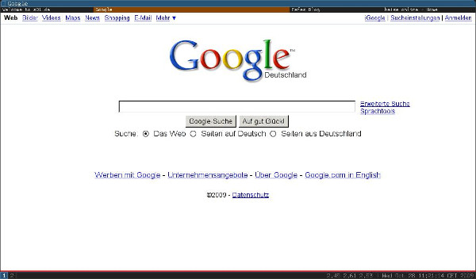
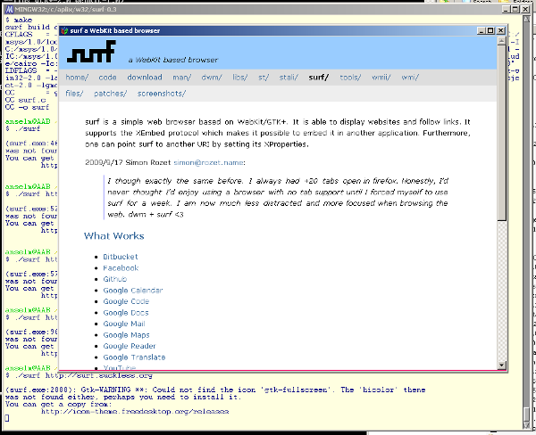
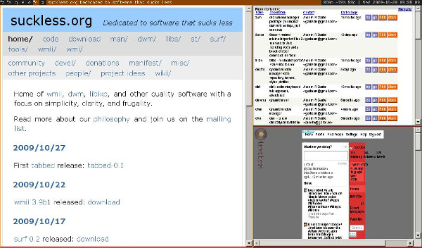
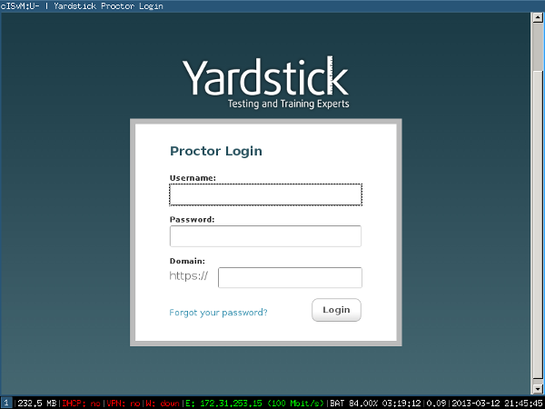

surf with [wmii](//dl.suckless.org/wmii/) using [tabbed](//tools.suckless.org/tabbed)

surf on win32 with a webkitgtk build targetting Windows underneath.

surf with [dwm](//dwm.suckless.org)

surf in kiosk mode, used in an online exam taking system
