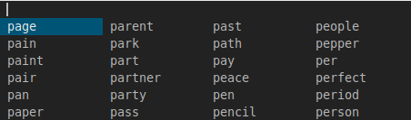

grid
====
This patch allows you to render dmenu's entries in a grid by adding a new
`-g` flag to specify the number of grid columns. You can use `-g` and `-l`
together to create a G columns * L lines grid.

This can help save screenspace over the default, 1 column, behavior of `-l`.

Download
--------
* [dmenu-grid-4.9.diff](dmenu-grid-4.9.diff)

Author
------
* Miles Alan <m@milesalan.com>
