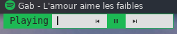

preselect
=========

Description
-----------
This patch adds an option to preselect an item by providing a number. This number
is the item order in the input list starting from 0. A use case is for selecting
media controls like in the following screenshot.

Create menu with the second item preselected:

	echo -c 'item1\nitem2\nitem3' | dmenu -n 1

Download
--------
* [dmenu-preselect-20200513-db6093f](dmenu-preselect-20200513-db6093f.diff) (2020-05-13)

Authors
-------
* Mathieu Moneyron <mathieu.moneyron@gmail.com>
