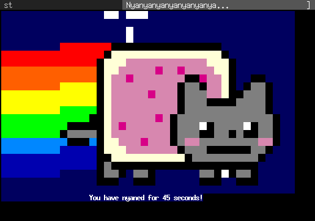

tabbed
======
Simple generic tabbed frontend to xembed-aware applications, originally designed
for [surf](//surf.suckless.org) but also usable with many other applications,
i.e. [st](//st.suckless.org), [uzbl](http://uzbl.org),
[urxvt](http://software.schmorp.de/pkg/rxvt-unicode.html) and
[xterm](http://invisible-island.net/xterm/)

Development
-----------
You can [browse](//git.suckless.org/tabbed) its source code repository or get a
copy using the following command:

	git clone https://git.suckless.org/tabbed

Download
--------
* [tabbed-0.6](//dl.suckless.org/tools/tabbed-0.6.tar.gz) (20140121)

